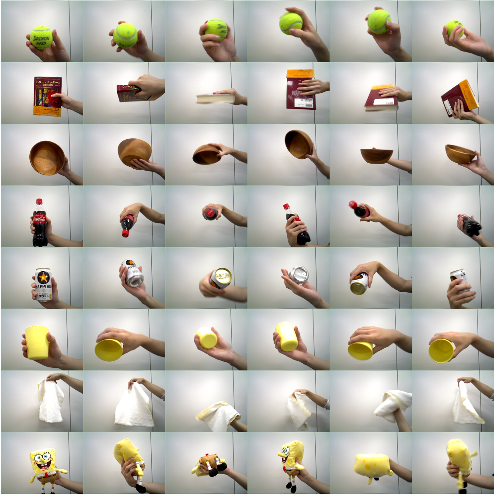
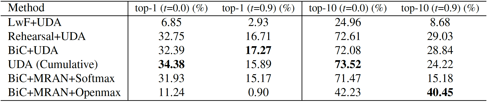

# What is COSDA?

The object recognition ability is indispensable for robotsto act like humans in a home environment. For example, when considering an object searching task, humans can recognize a naturally arranged object previously held intheir hands while ignoring never observed objects. Evenin such a simple task, we need to deal with three complex problems: **domain adaptation**, **open-set recognition**, and **continual learning**. However, most existing datasetsare simplified to focus on one problem and do not measure the object recognition ability for home robots when multiple problems are mixed in. We propose a Continual Open Set Domain Adaptation (COSDA) Dataset that requires dealing with the above three problems simultaneously. 

# Dataset
COSDA, specifically designed for (C)ontinual (O)pen-(S)et (D)omain (A)daptation. All images in the COSDA dataset are captured by theXtion RGB-D sensor mounted at the eye-level of the Toyota Human Support Robot (HSR) whose appearanceand specifications are shown in the supplementary material. In addition to RGB images, depth information is alsoavailable in our dataset although we do not use it in this paper. There are 16 super categories and each category has different 10 instances, thus there are  160 classes in total. The 16 super categories are selected from those commonly appear in a home environment which include ball, book, bowl, toy block, can, cup, dish, glass bottle, mobile phone,pen, plastic bottle, plush doll, TV controller, scissors, socks, and towel. 

# Benchmark

